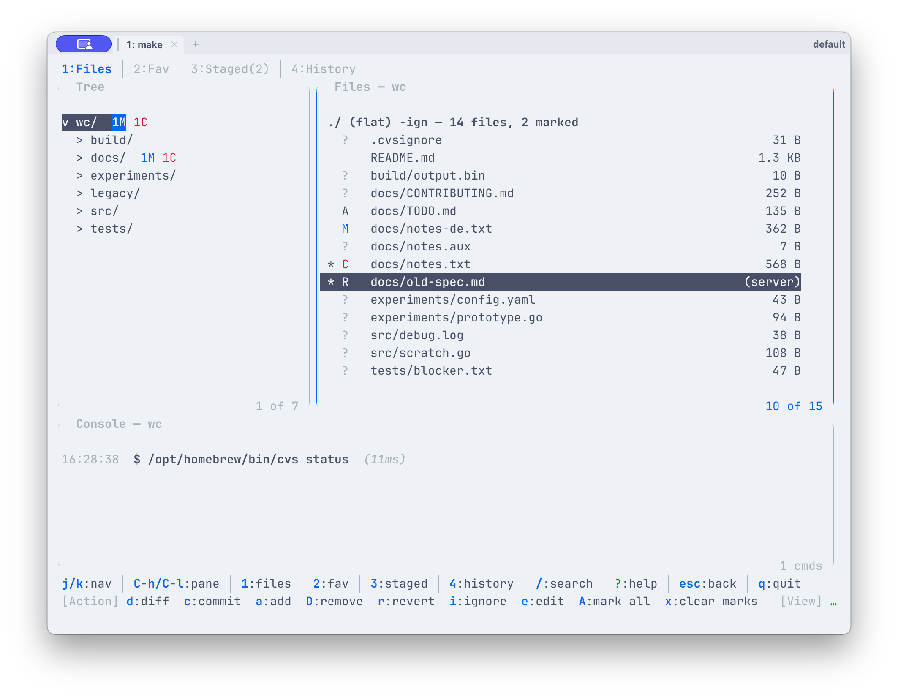

# lazycvs

A lazygit-inspired terminal UI for CVS, written in Go.

Wraps the `cvs` CLI so daily workflows — status, diff, commit, conflict
resolution, history, blame — happen in a fast keyboard-driven dashboard
instead of disjoint shell commands.

<!-- TODO: screenshot of the Files tab against the demo repo

-->

## Requirements

- The system `cvs` binary (1.11+) on `PATH` — lazycvs is a frontend, all
  repository access goes through it. Override with `-cvs /path/to/cvs`
  or `[cvs] binary` in the config.
- A terminal. That's it — no server component, no daemon.
- Go 1.24+ only if you build from source.

## Install

**With Go:**

```bash
go install github.com/kmax-tech/lazycvs@latest
```

The binary lands in `$(go env GOPATH)/bin` (usually `~/go/bin`) — make sure
that's on your `PATH`.

**From source:**

```bash
git clone https://github.com/kmax-tech/lazycvs
cd lazycvs
make build          # builds ./lazycvs
make release        # or: cross-compile for linux/mac/windows under dist/
```

## Quick start

```bash
lazycvs             # opens the TUI in the current working copy
lazycvs ~/work/repo # or at an explicit path
lazycvs init        # bootstrap: check out a fresh module into an empty dir
```

`lazycvs` looks at your current directory first; if it isn't a CVS working
copy and you set `[cvs] default_path` in your config, it falls back there.

## Optional: shell function for the from-source workflow

If you run lazycvs from a clone (rather than an installed binary) and want
to drop into it from any terminal, add this to `~/.zshrc` or `~/.bashrc`:

```bash
export LAZYCVS_REPO="$HOME/projects/lazycvs"   # adjust to your clone

lcvs() {
    local bin="$LAZYCVS_REPO/lazycvs"

    # `lcvs build` rebuilds from source.
    if [ "$1" = "build" ]; then
        ( cd "$LAZYCVS_REPO" && go build -o lazycvs . ) \
            && echo "lcvs: built $bin"
        return $?
    fi

    if [ ! -x "$bin" ]; then
        echo "lcvs: not built yet — run: lcvs build" >&2
        return 1
    fi

    # Run from the caller's cwd so [path] arg + working-copy detection work.
    "$bin" "$@"
}
```

Behavior:

| Invocation                       | What happens                              |
|----------------------------------|-------------------------------------------|
| `lcvs build`                     | `go build` in the repo, binary lands at `$LAZYCVS_REPO/lazycvs` |
| `lcvs`                           | TUI opens in the current working directory |
| `lcvs ~/work/repo`               | TUI opens at the explicit path             |
| `lcvs -cvs /opt/cvs/bin/cvs`     | flags pass through to the binary           |
| `lcvs -config /tmp/cfg.toml`     | dito                                       |

Build is **explicit** — no surprise compilation when you just want the
TUI. Daily use is just `cd` into a CVS checkout and type `lcvs`.

For zsh tab-completion on `lcvs build`:

```bash
compdef '_arguments "1:command:(build)"' lcvs
```

## Try it without a real repo

The repo ships a self-contained demo that creates a local CVS repository,
populates it with revisions and a real merge conflict, and launches `lazycvs`
against it — no server required.

```bash
make demo           # build + setup + launch
make demo-setup     # setup only (inspect with cvs CLI first)
make demo-clean     # tear down
```

The demo working copy ends up under `_lazycvs-demo/wc/` and includes one
file in every status the TUI cares about: `M`, `?`, `A`, `C`, `R`, plus
multi-revision history for the History tab.

## Configuration

Default path on macOS: `~/Library/Application Support/lazycvs/config.toml`
(other platforms: `$XDG_CONFIG_HOME/lazycvs/config.toml`).

```toml
[cvs]
binary       = "cvs"
default_path = "~/work/my-cvs-checkout"   # used when cwd has no CVS metadata

[editor]
diff_tool  = "meld"   # 2-way diff for E key
merge_tool = "meld"   # 3-way merge for M key (only on conflict files)
alt_open   = "code --goto $FILE"   # Ctrl-o: alternate opener (detached)
```

Built-in diff/merge presets: `vscode`, `emacs`, `vimdiff`, `nvimdiff`, `meld`,
`opendiff`, `kdiff3`, `diffuse`, `bcompare`. Terminal tools (`vimdiff`,
`nvimdiff`) suspend the TUI while open; GUI tools launch detached — inferred
from the binary name, overridable with `diff_terminal` / `merge_terminal`
(for wrapper scripts or tools the inference doesn't know). Or set
`diff_command` / `merge_command` to a custom template using `$LEFT`/`$RIGHT`
(diff) or `$BASE`/`$LOCAL`/`$REMOTE`/`$MERGED` (merge) placeholders.

## Tabs

| Key | Tab | Purpose |
|---|---|---|
| `1` | Files | Tree + file list, status markers, mark for commit |
| `2` | Favorites | Pinned directories with live status counts |
| `3` | Staged | Files marked with `space`; `c` opens commit input |
| `4` | History | Revisions + working copy as a synthetic top row |

## Key actions on a file

| Key | Action |
|---|---|
| `space` | mark / unmark for commit |
| `c` | commit (universal — `?` files get cvs-add first) |
| `r` | revert (`cvs update -C`, with backup) |
| `D` | remove (`cvs remove -f`) |
| `e` / `Ctrl-e` | open in `$EDITOR` |
| `E` | open in configured external diff tool |
| `M` | open in configured external merge tool (conflict files only) |
| `Ctrl-o` | open with the alternate opener (`[editor] alt_open`), detached |
| `Ctrl-r` | reveal in the file manager |
| `Ctrl-y` | copy absolute path to clipboard |
| `i` | add to `.cvsignore` |
| `d` | open History tab pre-loaded with this file |
| `u` | `cvs update` |

The keybar at the bottom always shows what's available in the current
context. `?` opens the help overlay with the full keymap.

## Documentation

- [`docs/USER_GUIDE.md`](docs/USER_GUIDE.md) — full user guide:
  every key, every tab, the History compare semantics, common
  workflows, and troubleshooting.
- [`docs/ARCHITECTURE.md`](docs/ARCHITECTURE.md) — technical guide
  for contributors: module layout, async caching pattern, status
  refresh flow, design choices, and a "where things live" cheat
  sheet.
- [`issues/`](issues/) — post-mortems for non-trivial bugs.
  Especially worth reading: 010 (History refactor) and 011
  (Latin-1 encoding glitches).

## Project layout

- `main.go` — entry point + CLI args + working-copy resolution
- `cvs/` — pure CVS data layer (string in, struct out)
- `tui/` — Bubble Tea TUI (lazygit-style panels)
- `config/`, `fs/` — supporting packages
- `scripts/demo.py` — standalone CVS demo generator
- `docs/` — user and architecture guides
- `issues/` — bug post-mortems

## Build

```bash
make build              # local binary
make release            # cross-compile for linux/mac/windows under dist/
make clean              # remove ./lazycvs and dist/
make check              # gofmt-clean + go vet + go test — run before committing
```

Formatting is plain `gofmt`; `make check` fails on any drift. Pure-formatting
commits are listed in `.git-blame-ignore-revs` (GitHub's blame view skips them
automatically; locally: `git config blame.ignoreRevsFile .git-blame-ignore-revs`).

Go 1.24+ required. Stdlib + a small set of `charmbracelet` libraries for
the TUI; CVS interaction goes through `os/exec` against the system `cvs`
binary.

## License

[MIT](LICENSE)
